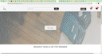

# Alpha Cart

Alpha Cart is an e-commerce site, from this site you can get the best-branded products.

---

## Contains

Currently, it contains screens for the following screens.

- Home [https://alphacart.netlify.app/]
- Products [https://alphacart.netlify.app/products/products.html]
- Cart Management [https://alphacart.netlify.app/cart/cart.html]
- Wishlist Management [https://alphacart.netlify.app/wishlist/wishlist.html]
- Log In [https://alphacart.netlify.app/login/login.html]
- Sign Up [https://alphacart.netlify.app/signup/signup.html]

---

## 👨‍💻 Connect with me

---

